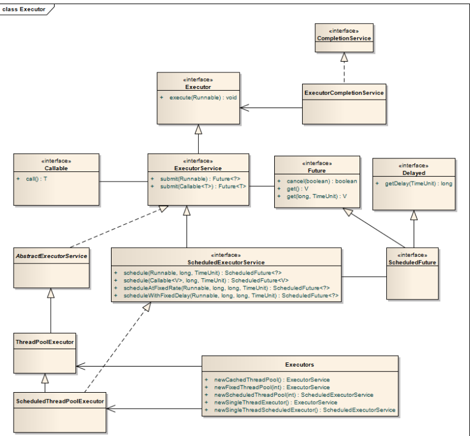
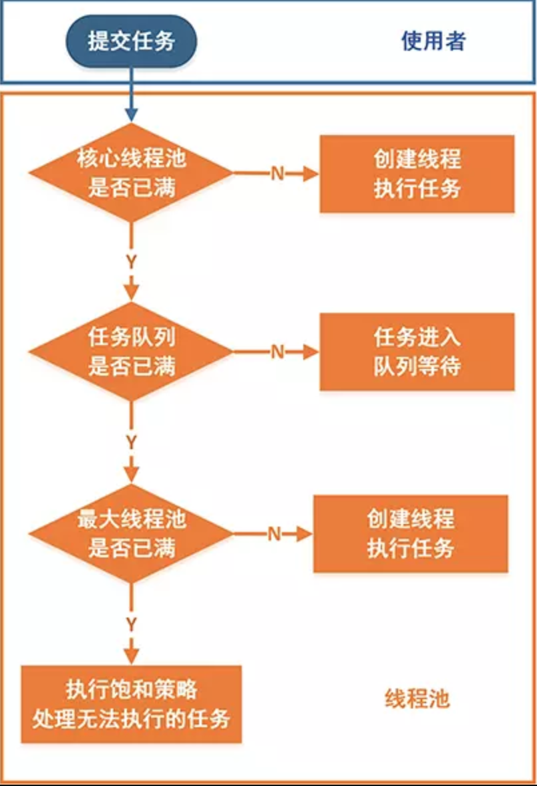
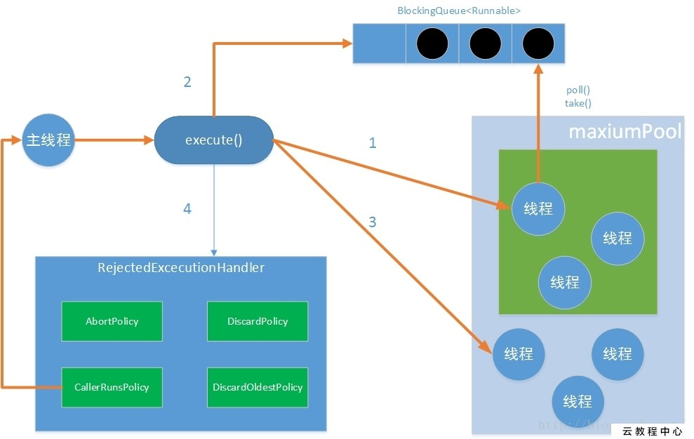

# Spring Multi-Task

本文件會說明在Spring Boot下使用多執行緒執行排程與非同步作業


## ThreadPool

Thread不是開越多越好，因為開Thread的成本很高，開越多消秏越多資源，整體執行也越慢，所以需要對同時間運行的Thread有一定的限制，Java自1.5起提供了`java.util.concurrent package`裡面提供了所有原生的concurrent programming需要的classes, ThreadPool是裡面一個很重要的工具，Spring又在上面包裝了一層來實作Spring中對ThreadPool的整合。

下圖是Java中ThreadPool相關的classes：




## ThreadPoolExecutor


Java中最重要的ThreadPool的核心是`java.util.concurrent.ThreadPoolExecutor`, 以下就這個class做說明。

下面這個是`ThreadPoolExecutor`最完整的建構子：

```java
public ThreadPoolExecutor(int corePoolSize,
                              int maximumPoolSize,
                              long keepAliveTime,
                              TimeUnit unit,
                              BlockingQueue<Runnable> workQueue,
                              ThreadFactory threadFactory,
                              RejectedExecutionHandler handler)
```


* corePoolSize

* maximumPoolSize

* keepAliveTime

* BlockingQueue<Runnable> workQueue

  當正在執行的Task超過corePoolSize時會先被被queue起來等待有空閒thread再執行

* threadFactory

  自訂義Thread的生產工廠，可以對新產的Thread客製化

* RejectedExecutionHandler


### Task處理流程






### BlockingQueue

* SynchronousQueue
* 有界BlockingQueue

  * LinkedBlockingQueue

* 無界BlockingQueue

  * ArrayBlockingQueue 

  > 注意：使用無界BlockingQueue下ThreadPoolExecutor`的maximumPoolSize無效


### Reject Policy when full of ThreadPool

在默认的 [ `ThreadPoolExecutor.AbortPolicy`](../../../java/util/concurrent/ThreadPoolExecutor.AbortPolicy.html) 中，处理程序遭到拒绝将抛出运行时 [ `RejectedExecutionException`](../../../java/util/concurrent/RejectedExecutionException.html)。 

在 [ `ThreadPoolExecutor.CallerRunsPolicy`](../../../java/util/concurrent/ThreadPoolExecutor.CallerRunsPolicy.html) 中，线程调用运行该任务的 `execute` 本身。此策略提供简单的反馈控制机制，能够减缓新任务的提交速度。 

在 [ `ThreadPoolExecutor.DiscardPolicy`](../../../java/util/concurrent/ThreadPoolExecutor.DiscardPolicy.html) 中，不能执行的任务将被删除。 

在 [ `ThreadPoolExecutor.DiscardOldestPolicy`](../../../java/util/concurrent/ThreadPoolExecutor.DiscardOldestPolicy.html) 中，如果执行程序尚未关闭，则位于工作队列头部的任务将被删除，然后重试执行程序（如果再次失败，则重复此过程

> 注意：AbortPolicy如果無法接受task會噴RejectedExecutionException

## Executors

Java原生還提供一些常用的工廠，可以方便的產生需要的ThreadPool.. 

| Name                                       | Description                                                  |
| ------------------------------------------ | ------------------------------------------------------------ |
| Executors.newSingleThreadPool()            | 產生一個只有一個thread的thread pool。                        |
| Executors.newFixedThreadPool(int nThreads) | 產生固定thread數量的thread pool                              |
| Executors.newCachedThreadPool()            | 產生沒有數量上限的thread pool。Thread的數量會根據使用狀況動態的增加或是減少。 |

> 注意：最好不要用


## Spring Integration

Spring在Java原生的ThreadPool上會加上一層自己的實作以方便在Spring中取用與設定。

* ThreadPoolTaskExecutor

* ThreadPoolTaskScheduler


## Spring Scheduled Task

Spring提供簡單的排程機制，整合了常用的Quartz及Java Timer，只要設成完成後，直接使用@Scheduled就可以方便的撰寫各種排程。支援的排程機制有：

* cron

  ex: 0 */3 * * * *

  參考Spring [Javadoc](https://docs.spring.io/spring-framework/docs/current/javadoc-api/org/springframework/scheduling/support/CronSequenceGenerator.html)

* fixedRate

  Task start -> 固定時間 -> Task start

* fixedDelay

  Task end -> 固定時間 -> Task start

設定:

```java
@Configuration
@EnableScheduling
public class SchedulingConfig implements SchedulingConfigurer {

    @Override
    public void configureTasks(ScheduledTaskRegistrar taskRegistrar) {
        taskRegistrar.setTaskScheduler(taskScheduler());
    }

    @Bean
    TaskScheduler taskScheduler() {
        ThreadPoolTaskScheduler threadPoolTaskScheduler = new ThreadPoolTaskScheduler();
        threadPoolTaskScheduler.setPoolSize(10);
        return threadPoolTaskScheduler;
    }
}

```

撰寫Scheduled Task

```java
@Component
public class DemoScheduledTask {

    private Logger logger = LoggerFactory.getLogger(DemoScheduledTask.class);
    private Marker MARKER_SCHEDULE = MarkerFactory.getMarker("SCHEDULE");

    @Scheduled(cron="0 */3 * * * *")
    public void doTask() {
        logger.debug(MARKER_SCHEDULE, "Start to do scheduled task in {}", Thread.currentThread());
    }
}
```


## Spring Async Task

設定Async:

```java
@Configuration
@EnableAsync
public class AsyncConfig implements AsyncConfigurer {
    
    @Override
    public Executor getAsyncExecutor() {
        return taskExecutor();
    }

    @Bean()
    TaskExecutor taskExecutor() {
        ThreadPoolTaskExecutor threadPoolTaskExecutor = new ThreadPoolTaskExecutor();
        threadPoolTaskExecutor.setCorePoolSize(5);
        threadPoolTaskExecutor.setMaxPoolSize(10);
        threadPoolTaskExecutor.setKeepAliveSeconds(60);
        threadPoolTaskExecutor.setQueueCapacity(5);
        return threadPoolTaskExecutor;
    }
}
```


寫AsyncTask:

```java
@Component
@Async
public class AsyncTask {

    Logger logger = LoggerFactory.getLogger(AsyncDemoController.class);

    @Async
    public void asyncService() {
        Marker MARKER_ASYNC = MarkerFactory.getMarker("ASYNC");
        logger.debug(MARKER_ASYNC, "Doing async task in {}", Thread.currentThread());
        try {
            Thread.sleep(5000);
        } catch (InterruptedException e) {
            e.printStackTrace();
        }
        logger.debug(MARKER_ASYNC, "Done async task in {}", Thread.currentThread());
    }

}
```


使用AsyncTask:

```java
@Controller
public class AsyncDemoController {

    Logger logger = LoggerFactory.getLogger(AsyncDemoController.class);

    @Autowired
    private AsyncTask asyncTask;

    @GetMapping("/demo/async")
    @ResponseBody
    public String testAsync() {
        Marker MARKER_ASYNC = MarkerFactory.getMarker("ASYNC");
        logger.debug(MARKER_ASYNC, "Prepare to launch a async task in {}", Thread.currentThread());
        asyncTask.asyncService();
        return String.valueOf(Thread.currentThread());
    }
}
```


## Best Practice

- CPU-Bound Thread

- IO-Bound Thread

- Not to use Executors

- Parameterizing
- ThreadLocal
- Logging MDC


## Reference

* [详解Java中ThreadPool的使用](https://www.jianshu.com/p/2dc69025cebe)
* [Java 线程池是如何工作的](https://www.linuxprobe.com/java-threadpool-principle.html)
* [Java 并发之 ScheduledThreadPoolExecutor 原理分析](https://my.oschina.net/lifany/blog/153145)
* [深入理解Java线程池：ScheduledThreadPoolExecutor](https://www.jianshu.com/p/925dba9f5969)
* [A Guide to the Spring Task Scheduler](https://www.baeldung.com/spring-task-scheduler)
* [The @Scheduled Annotation in Spring](https://www.baeldung.com/spring-scheduled-tasks)

